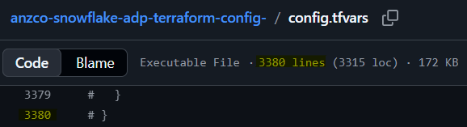

# Table of Contents
1. [Problem](#problem)
2. [Solution](#solution)
3. [Folder Structure](#folder-structure)
4. [Configurations](#configurations)
   * [Account Parameters Configuration](#account-parameters-configuration)
   * [Network Rules Configuration](#network-rules-configuration)
   * [Network Policies Configuration](#network-policies-configuration)
   * [Account Roles Configuration](#account-roles-configuration)
   * [Users Configuration](#users-configuration)
   * [User Role Assignments Configuration](#user-role-assignments-configuration)
   * [Databases Configuration](#databases-configuration)
   * [Schemas Configuration](#schemas-configuration)
   * [Database Grants Configuration](#database-grants-configuration)
   * [Schema Grants Configuration](#schema-grants-configuration)
   * [Role Hierarchy Configuration](#role-hierarchy-configuration)
   * [Ownerships Configuration](#ownerships-configuration)

# Problem

A single, monolithic configuration file introduces challenges:

- Hard to understand, maintain and debug.
- Prone to merge conflicts in multi-user environments.



# Solution

Split configurations into multiple modular YAML files.

- **Zero HCL Syntax**: Purely descriptive YAML files that require zero Terraform knowledge.
- **Modularity**: Clear folder boundaries organized per environment.
- **Easy to Maintain**: Adding a new database, for example, is as simple as dropping a new YAML file into a folder.


# Folder Structure

| Configuration Item | Path Pattern | Scope |
| :--- | :--- | :--- |
| **Permission Sets** | `configs/envs/common/governance_security/permission_sets.yaml` | Common |
| **Account Parameters** | `configs/envs/common/governance_security/account_parameter.yaml` | Common |
| **Network Rules** | `configs/envs/common/governance_security/network_rules.yaml` | Common |
| **Network Policies** | `configs/envs/common/governance_security/network_policies.yaml` | Common |
| **Account Roles** | `configs/envs/*/governance_security/roles/*.yaml` | Env-Specific |
| **Users** | `configs/envs/common/governance_security/users.yaml` | Common |
| **User Role Assignments** | `configs/envs/common/governance_security/user_role_assignments.yaml` | Common |
| **Databases** | `configs/envs/*/catalog/databases/*.yaml` | Env-Specific |
| **Schemas** | `configs/envs/*/catalog/schemas/*.yaml` | Env-Specific |
| **Database Grants** | `configs/envs/*/governance_security/database_grants/*.yaml` | Env-Specific |
| **Schema Grants** | `configs/envs/*/governance_security/schema_grants/*.yaml` | Env-Specific |
| **Role Hierarchy** | `configs/envs/*/governance_security/role_hierarchy.yaml` | Env-Specific |
| **Ownerships** | `configs/envs/*/governance_security/ownerships.yaml` | Env-Specific |


# Configurations

## Account Parameters Configuration

**Location:** configs/envs/common/governance_security/account_parameter.yaml

**Pattern:** Key-Value Map

This file contains global, account-wide behavioral and security settings. The keys correspond directly to valid Snowflake parameter names, and the values can be strings, integers, or booleans depending on the parameter type.

### Common Parameter Definitions
Any valid Snowflake account parameter can be added.

### **YAML Blueprint Example**

YAML
```yaml
# Regional & Formatting
TIMEZONE: "Pacific/Auckland"
WEEK_START: 1
WEEK_OF_YEAR_POLICY: 1

# Authentication
ENABLE_IDENTIFIER_FIRST_LOGIN: true
ALLOW_ID_TOKEN: true

# Security
REQUIRE_STORAGE_INTEGRATION_FOR_STAGE_CREATION: true
REQUIRE_STORAGE_INTEGRATION_FOR_STAGE_OPERATION: false
PREVENT_UNLOAD_TO_INLINE_URL: false
CLIENT_ENCRYPTION_KEY_SIZE: 256

# Session Parameter (Applied globally at account level)
BINARY_OUTPUT_FORMAT: "BASE64"
```

---

## Network Rules Configuration

**Location:** configs/envs/common/governance_security/network_rules.yaml

**Pattern:** Key-Value Map of Objects

Network rules represent reusable groupings of IP addresses, subnets, or domains. The top-level YAML keys are used directly as the Snowflake resource names.

### Structure Definitions

| Parameter | Type | Required | Description | Default / Fallback |
| :---- | :---- | :---- | :---- | :---- |
| database | String | **Yes** | Database where the rule metadata object is stored. | N/A |
| schema | String | **Yes** | Schema where the rule metadata object is stored. | N/A |
| type | String | **Yes** | Network rule type (e.g., IPV4, IPV6, AWS_VPCE_ID). | N/A |
| mode | String | **Yes** | Action mode (e.g., INGRESS, EGRESS). | N/A |
| value_list | List (String) | **Yes** | Array of IP addresses or subnets (e.g., CIDR notation or raw IPs). | N/A |
| comment | String | No | Description or source tracking reference. | null |

### **YAML Blueprint Example**

YAML  
```yaml
DBT_IP_US_ALLOWED:
  database: "PLATFORM_DATA_MANAGEMENT"
  schema: "DATA_GOVERNANCE"
  type: "IPV4"
  mode: "INGRESS"
  value_list:
    - "52.22.161.231"
    - "52.45.144.63"
    - "54.81.134.249"
  comment: "DBT (transformation tool) allowed IP addresses"

SPARK_NETWORK_IP_ALLOWED:
  database: "PLATFORM_DATA_MANAGEMENT"
  schema: "DATA_GOVERNANCE"
  type: "IPV4"
  mode: "INGRESS"
  value_list:
    - "219.88.198.160/29" # SparkBYOD MDR
    - "219.88.198.176/29" # SparkBYOD PAK
    - "122.57.19.32"      # Local IP retrieved with `curl ifconfig.me` command.
```

---

## Network Policies Configuration

**Location:** configs/envs/common/governance_security/network_policies.yaml

**Pattern:** Key-Value Map of Objects

Network policies act as active firewalls. They map policy names to lists of **Network Rules** that should be allowed or blocked. Our policy engine resolves these rule names to their dynamic, fully qualified paths automatically.

### Structure Definitions

| Parameter | Type | Required | Description | Default / Fallback |
| :---- | :---- | :---- | :---- | :---- |
| comment | String | No | Description of the policy. | null |
| allowed_network_rule_list | List (String) | **Yes** | List of top-level Network Rule names to allow. | N/A |
| blocked_network_rule_list | List (String) | No | List of top-level Network Rule names to block. | [] |

### **YAML Blueprint Example**

YAML
```yaml
GLOBAL_INGRESS_POLICY:
  comment: "Global corporate and transformation tool ingress firewall"
  allowed_network_rule_list:
    - DBT_IP_US_ALLOWED
    - SPARK_NETWORK_IP_ALLOWED
  blocked_network_rule_list: []
```

---

## Account Roles Configuration

**Location:** configs/envs/\*/governance_security/roles/*.yaml 
**Pattern:** List of Role Objects

Account roles can now be consolidated into a single master configuration file or split logically across multiple files (e.g., `core_roles.yaml`, `dev_roles.yaml`). The HCL engine automatically gathers all files, flattens the lists, and maps them uniquely by the uppercase `name` value to ensure seamless integration with the underlying module execution graph.

### Structure Definitions

| Parameter | Type | Required | Description | Default / Fallback |
| :--- | :--- | :--- | :--- | :--- |
| `name` | String | **Yes** | The unique identifier for the Snowflake account role. Dynamically standardized to uppercase. | N/A |
| `comment` | String | No | Descriptive note explaining the responsibilities or ownership of the role. | `null` |

### YAML Blueprint Example
```yaml
- name: "DEV_INGESTION_ROLE"
  comment: "Role for data ingestion jobs (e.g. Snowpipe, Streams, Tasks)"

- name: "DEV_TRANSFORMER_ROLE"
  comment: "Role for running dbt/data transformation jobs"

- name: "DEV_REPORTING_ROLE"
  comment: "Role for BI tools and analysts to consume report data"
```

---

## Users Configuration

**Location:** configs/envs/common/governance_security/users.yaml

**Pattern:** Key-Value Map of Objects

Our user provisioning engine is entirely generic. You can specify *any* parameter supported by the snowflake_user resource in your YAML block. The module dynamically reads these attributes, allowing you to append metadata fields without needing to adjust the underlying Terraform module.

### Structure Definitions (Common Attributes)

| Parameter | Type | Required | Description | Default / Fallback |
| :---- | :---- | :---- | :---- | :---- |
| login_name | String | No | Login identifier for the user. | Falls back to the top-level YAML key |
| comment | String | No | User account description. | null |
| disabled | Boolean | No | Disables or suspends the user. | false |
| default_warehouse | String | No | Default virtual warehouse for active queries. | null |
| default_role | String | No | Default role granted on session initialization. | null |
| network_policy | String | No | Attaches a Network Policy to enforce restrictions specifically on this user. | null |
| email | String | No | User contact email address. | null |
| first_name | String | No | User's first name. | null |
| last_name | String | No | User's last name. | null |

### YAML Blueprint Example

YAML
```yaml
TRANSFORMER_SVC_USER:
  password: "ChangeMe123!"
  login_name: "TRANSFORMER_SVC_USER"
  display_name: "Transformer Service User"
  first_name: "Transformer"
  last_name: "Service User"
  email: ""
  must_change_password: false
  comment: "Service account for transformation pipelines - Restricted Network"
  disabled: false
  default_warehouse: "COMPUTE_WH"
  default_role: "DEV_TRANSFORMER_ROLE"
  # This explicitly binds custom policy to this user 
  network_policy: "GLOBAL_INGRESS_POLICY"
```

---

## User Role Assignments Configuration

**Location:** configs/envs/common/governance_security/user_role_assignments.yaml

**Pattern:** List of Member-to-Role Assignment Objects

Used to map corporate roles to individual user accounts. To ensure state consistency and avoid conflicts, this file behaves purely as a membership assignment registry.

### Structure Definitions

| Parameter | Type | Required | Description | Default / Fallback |
| :---- | :---- | :---- | :---- | :---- |
| user | String | **Yes** | Target username to receive the role. | N/A |
| role | String | **Yes** | Target role name to assign. | N/A |

### YAML Blueprint Example

YAML 
```yaml
- user: "TRANSFORMER_SVC_USER"
  role: "DEV_TRANSFORMER_ROLE"
```

---

## Databases Configuration

**Location:** configs/envs/\*/catalog/databases/*.yaml

**Pattern:** List of Database Objects

You can define all databases in a single file or split them across multiple files (e.g., by environment or data domain). The parsing engine flattens lists from all matching files and keys them by the uppercase name property.

### Structure Definitions

| Parameter | Type | Required | Description | Default / Fallback |
| :---- | :---- | :---- | :---- | :---- |
| name | String | **Yes** | Unique identifier for the database. Standardized to uppercase. | N/A |
| comment | String | No | Description / purpose of the database. | null |
| data_retention_time_in_days | Integer | No | Number of days to retain historical data for Time Travel. | null |
| is_transient: false | Boolean | No | Transient database | null |

### YAML Blueprint Example

YAML 
```yaml
- name: "DEV_RAW"
  comment: "Data Lake Landing Zone."
  is_transient: true
  data_retention_time_in_days: 1

- name: "DEV_ANALYTICS"
  comment: "Analytics Data Warehouse."
  is_transient: true
  data_retention_time_in_days: 1
```

---

## Schemas Configuration

**Location:** configs/envs/\*/catalog/schemas/*.yaml

**Pattern:** List of Schema Objects

Schemas are defined in lists and can be grouped in any way you prefer (e.g., all schemas for a specific database in one file, or split logically). The engine automatically constructs the tracking keys using the format DATABASE.SCHEMA.

### Structure Definitions

| Parameter | Type | Required | Description | Default / Fallback |
| :---- | :---- | :---- | :---- | :---- |
| database | String | **Yes** | The parent database where this schema will be created. | N/A |
| name | String | **Yes** | The name of the schema. | N/A |
| comment | String | No | Description of the schema's purpose. | null |
| data_retention_time_in_days | Integer | No | Overrides the database's default retention setting. | null |
| with_managed_access | Boolean | No | Enables managed access schemas (centralized grant control). | null |

### YAML Blueprint Example

YAML
```yaml
- database: "DEV_ANALYTICS"
  name: "STAGE"
  comment: "Raw data landing zone for incoming data"
  data_retention_time_in_days: 0
  with_managed_access: true

- database: "DEV_ANALYTICS"
  name: "INTERMEDIATE"
  comment: "Transformed data for analytical use."
  data_retention_time_in_days: 0
  with_managed_access: true

- database: "DEV_ANALYTICS"
  name: "SNAPSHOT"
  comment: "Point-in-time copies of analytical data for historical analysis and reporting."
  data_retention_time_in_days: 0
  with_managed_access: true

- database: "DEV_ANALYTICS"
  name: "MARTS"
  comment: "Business-facing reporting layers and data marts (Gold layer)."
  data_retention_time_in_days: 0
  with_managed_access: true
```

---


## Database Grants Configuration

**Location:** `configs/envs/*/governance_security/database_grants/*.yaml`  
**Pattern:** List of Database Grant Assignment Objects

Database grants are stored as a flat list of explicit mappings. Each object binds a single database, role, and corporate privilege together.

### Structure Definitions

| Parameter | Type | Required | Description | Default / Fallback |
| :--- | :--- | :--- | :--- | :--- |
| `database` | String | **Yes** | The target database on which the privilege is granted. Standardized to uppercase. | N/A |
| `role` | String | **Yes** | The Snowflake account role receiving the privilege. Standardized to uppercase. | N/A |
| `privilege` | String | **Yes** | The exact privilege to grant (e.g., `USAGE`, `ALL PRIVILEGES`, `CREATE SCHEMA`). | N/A |

### YAML Blueprint Example

```yaml
# DEV_RAW Grants
- database: "DEV_RAW"
  role: "DEV_INGESTION_ROLE"
  privilege: "ALL PRIVILEGES"

- database: "DEV_RAW"
  role: "DEV_TRANSFORMER_ROLE"
  privilege: "USAGE"

# DEV_ANALYTICS Grants
- database: "DEV_ANALYTICS"
  role: "DEV_TRANSFORMER_ROLE"
  privilege: "ALL PRIVILEGES"

- database: "DEV_ANALYTICS"
  role: "DEV_REPORTING_ROLE"
  privilege: "USAGE"
```

---

## Schema Grants Configuration

**Location:** `configs/envs/*/governance_security/schema_grants/*.yaml`  
**Pattern:** List of Schema Grant Assignment Objects

Schema grants are stored as a list of explicit mappings that bind target schemas within their parent databases to receiving roles, supporting multiple privileges defined cleanly as an array.

### Structure Definitions

| Parameter | Type | Required | Description | Default / Fallback |
| :--- | :--- | :--- | :--- | :--- |
| `database` | String | **Yes** | The parent database of the target schema. Standardized to uppercase. | N/A |
| `schema` | String | **Yes** | The target schema on which the privileges are granted. Standardized to uppercase. | N/A |
| `role` | String | **Yes** | The Snowflake account role receiving the privilege. Standardized to uppercase. | N/A |
| `privilege` | List (String) | **Yes** | The array of privileges to grant (e.g., `USAGE`, `CREATE TABLE`, `CREATE VIEW`). | N/A |

### YAML Blueprint Example

```yaml
# DEV_RAW
- database: "DEV_RAW"
  schema: "LANDING"
  role: "DEV_INGESTION_ROLE"
  privilege: 
    - "USAGE"
    - "CREATE TABLE"
    - "CREATE VIEW"
    - "CREATE FILE FORMAT"
    - "CREATE STAGE"
    - "CREATE PIPE"
    - "CREATE SEQUENCE"
    - "CREATE FUNCTION"
    - "CREATE PROCEDURE"
    - "CREATE STREAM"
    - "CREATE TASK"
    - "CREATE MATERIALIZED VIEW"

- database: "DEV_RAW"
  schema: "LANDING"
  role: "DEV_TRANSFORMER_ROLE"
  privilege: 
    - "USAGE"
```

---

## Role Hierarchy Configuration

**Location:** `configs/envs/*/governance_security/role_hierarchy.yaml`  
**Pattern:** List of Role-to-Role Grant Assignment Objects

Role-to-role relationships are stored as a flat list of explicit mappings. In Snowflake's authorization model, granting a child `role` to a `parent_role` allows the `parent_role` to inherit all rights and privileges of the child `role`.

### Structure Definitions

| Parameter | Type | Required | Description | Default / Fallback |
| :--- | :--- | :--- | :--- | :--- |
| `role` | String | **Yes** | The child role whose privileges are being inherited. Standardized to uppercase. | N/A |
| `parent_role` | String | **Yes** | The parent role receiving the inheritance. Standardized to uppercase. | N/A |

### YAML Blueprint Example

```yaml
- role: "DEV_TRANSFORMER_ROLE"
  parent_role: "SYSADMIN"

- role: "DEV_REPORTING_ROLE"
  parent_role: "SYSADMIN"

- role: "DEV_INGESTION_ROLE"
  parent_role: "SYSADMIN"
```

---

## Ownerships Configuration

**Location:** configs/envs/*/governance_security/ownerships.yaml
**Pattern:** Separated lists for `databases` and `schemas` ownership objects.

The YAML file is structured into two main sections:
1. **`databases`**: List of databases to have their ownership assigned.
2. **`schemas`**: List of schemas to have their ownership assigned (requires the parent database context).

### Structure Definitions

#### Database Ownership Objects
| Parameter | Type | Required | Description | Default / Fallback |
| :--- | :--- | :--- | :--- | :--- |
| `database_name` | String | **Yes** | The target database whose ownership will be transferred. Standardized to uppercase. | N/A |
| `account_role` | String | **Yes** | The target Snowflake account role that will own the database. Standardized to uppercase. | N/A |

#### Schema Ownership Objects
| Parameter | Type | Required | Description | Default / Fallback |
| :--- | :--- | :--- | :--- | :--- |
| `database_name` | String | **Yes** | The parent database of the target schema. Standardized to uppercase. | N/A |
| `schema_name` | String | **Yes** | The target schema whose ownership will be transferred. Standardized to uppercase. | N/A |
| `account_role` | String | **Yes** | The target Snowflake account role that will own the schema. Standardized to uppercase. | N/A |

### YAML Blueprint Example

```yaml
databases:
  - database_name: "DEV_RAW"
    account_role: "DEV_INGESTION_ROLE"

  - database_name: "DEV_ANALYTICS"
    account_role: "DEV_TRANSFORMER_ROLE"

schemas:
  - database_name: "DEV_RAW"
    schema_name: "LANDING"
    account_role: "DEV_INGESTION_ROLE"

  - database_name: "DEV_ANALYTICS"
    schema_name: "STAGE"
    account_role: "DEV_TRANSFORMER_ROLE"

  - database_name: "DEV_ANALYTICS"
    schema_name: "INTERMEDIATE"
    account_role: "DEV_TRANSFORMER_ROLE"

  - database_name: "DEV_ANALYTICS"
    schema_name: "MARTS"
    account_role: "DEV_TRANSFORMER_ROLE"

  - database_name: "DEV_ANALYTICS"
    schema_name: "SNAPSHOT"
    account_role: "DEV_TRANSFORMER_ROLE"
```

---